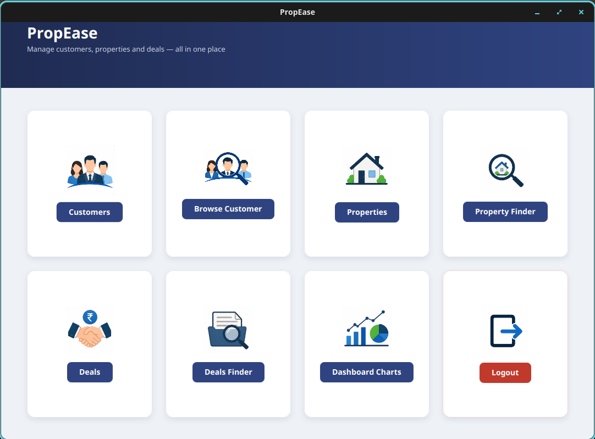

# 🏠 PropEase - Real Estate Management System

## 📌 Overview

PropEase is a Java desktop application developed to simplify real estate management.

The application helps manage:

- Customers
- Property Listings
- Property Search
- Property Deals
- Dashboard Reports

---

## 🚀 Technologies Used

- Java 21
- JavaFX 21.0.6
- Scene Builder
- MySQL 8.0+
- JDBC
- Maven
- Jakarta Mail (Email Service)
- iText (PDF Generation)
- Apache POI (Excel Generation)

---

## ✨ Features

- Secure Login
- Customer Management
- Browse Customers
- Property Listing
- Property Finder
- Finalized Deals
- Deals Finder
- Dashboard Charts
- Excel Report Generation
- PDF Report Generation
- Email Notifications

---

## 📋 Prerequisites

Before you begin, ensure you have installed:

- **Java 21+** - [Download here](https://www.oracle.com/java/technologies/downloads/#java21)
- **Maven 3.8+** - [Download here](https://maven.apache.org/download.cgi)
- **MySQL 8.0+** - [Download here](https://www.mysql.com/downloads/mysql/)
- **IntelliJ IDEA** (optional but recommended) - [Download here](https://www.jetbrains.com/idea/)

---

## 📂 Database Setup

### Step 1: Create Database

Open MySQL Workbench or MySQL CLI and run:

```sql
CREATE DATABASE javaproject;
```

### Step 2: Import SQL Script

The SQL file `project.sql` is included in the project root.

**Using MySQL CLI:**
```bash
mysql -u your_mysql_user -p javaproject < project.sql
```

**Using MySQL Workbench:**
1. Open MySQL Workbench
2. Connect to your MySQL server
3. Go to `File` → `Open SQL Script`
4. Select `project.sql`
5. Click Execute

The script will automatically create all required tables and insert the default admin account.

### Step 3: Verify Database

```sql
USE javaproject;
SHOW TABLES;
```

---

## 🔐 Environment Setup (Important!)

### Step 1: Create `.env` File

In the project root directory, create a `.env` file with your credentials:

```bash
# Database Configuration
DB_USER=your_mysql_username
DB_PASSWORD=your_mysql_password
DB_HOST=localhost

# Email Configuration (Gmail SMTP)
EMAIL_USER=your_email@gmail.com
EMAIL_PASSWORD=your_gmail_app_password
```

**⚠️ Important:** 
- The `.env` file is **NOT** tracked by Git (it's in `.gitignore`)
- **Never** commit this file to GitHub
- Each developer should create their own `.env` file locally
- Do NOT use your Gmail password directly - use an [App Password](https://support.google.com/accounts/answer/185833)

### Step 2: Get Gmail App Password (if using Gmail)

1. Go to [Google Account Security](https://myaccount.google.com/security)
2. Enable 2-Factor Authentication (if not already enabled)
3. Go to App Passwords
4. Select "Mail" and "Windows Computer"
5. Copy the generated 16-character password
6. Paste it as `EMAIL_PASSWORD` in your `.env` file

---

## 🔑 Default Login

After database setup, you can login with:

```
Username: admin
Password: 12345
```

⚠️ **Note:** Change this password after first login!

---

## ▶️ How to Run

### Option 1: Using Shell Script (Recommended)

```bash
cd /path/to/JAVAPROJECT
chmod +x run.sh
./run.sh
```

### Option 2: Using Maven Directly

```bash
cd /path/to/JAVAPROJECT
export DB_USER=your_mysql_username
export DB_PASSWORD=your_mysql_password
export DB_HOST=localhost
export EMAIL_USER=your_email@gmail.com
export EMAIL_PASSWORD=your_gmail_app_password
mvn javafx:run
```

### Option 3: Using IntelliJ IDEA

1. Open the project in IntelliJ IDEA
2. Go to `Run` → `Edit Configurations`
3. Select or create "HelloApplication" configuration
4. Under "Environment variables", add:
   ```
   DB_USER=your_mysql_username;DB_PASSWORD=your_mysql_password;DB_HOST=localhost;EMAIL_USER=your_email@gmail.com;EMAIL_PASSWORD=your_gmail_app_password
   ```
5. Click `Apply` → `OK`
6. Click the **Run** button ▶️

---

## 🛠️ Troubleshooting

### "Set DB_USER and DB_PASSWORD env variables!" Error

**Solution:** Ensure your `.env` file is created and environment variables are properly set.

```bash
# Check if env vars are set
echo $DB_USER
echo $DB_PASSWORD

# If empty, load from .env file
export $(cat .env | xargs)
```

### MySQL Connection Failed

**Solution:** Verify:
1. MySQL server is running: `mysql -u root -p`
2. Database exists: `SHOW DATABASES;`
3. Credentials in `.env` are correct

### Email Sending Failed

**Solution:**
1. Use Gmail App Password, NOT your account password
2. Enable 2-Factor Authentication on your Google account
3. Verify SMTP settings in `EmailService.java`

### JavaFX Version Mismatch Warning

This is a warning and can be safely ignored. It won't affect functionality.

---

## 📸 Screenshots

### Dashboard


### Customer Master


### Browse Customers


### Property Listing


### Property Finder


### Finalized Deals


### Dashboard Charts


---

## 📁 Project Structure

```
JAVAPROJECT/
├── src/main/java/
│   ├── com/example/javaproject/     # Main application entry point
│   ├── Customer/                    # Customer management
│   ├── Property/                    # Property management
│   ├── Deals/                       # Deals management
│   ├── Email/                       # Email service
│   ├── Login/                       # Login module
│   └── ...other modules
├── src/main/resources/
│   └── *v/*.fxml                    # JavaFX UI files
├── pom.xml                          # Maven configuration
├── project.sql                      # Database schema
├── .env                             # Environment variables (LOCAL ONLY)
├── .gitignore                       # Git ignore rules
└── run.sh                           # Startup script
```

---

## 🔒 Security Notes

✅ **What's Secure:**
- All sensitive credentials are stored in `.env` file
- `.env` is in `.gitignore` (never pushed to GitHub)
- Database passwords are NOT hardcoded
- Email credentials are NOT hardcoded
- Each developer can use their own credentials

⚠️ **What to Do:**
- Never commit `.env` file to Git
- Never hardcode passwords in source code
- Use environment variables for all sensitive data
- Change default login credentials after setup
- Use Gmail App Passwords instead of account password

---

## 📦 Building JAR

To create a distributable JAR file:

```bash
mvn clean package
```

The JAR will be created in the `target/` directory.

---

## 🤝 Contributing

1. Fork the repository
2. Create a feature branch (`git checkout -b feature/AmazingFeature`)
3. Commit your changes (`git commit -m 'Add some AmazingFeature'`)
4. Push to the branch (`git push origin feature/AmazingFeature`)
5. Open a Pull Request

---

## 📄 License

This project is open source and available under the MIT License.

---

## 👨‍💻 Author

Mahesh Singla

---

## 📞 Support

For issues or questions, please open an issue on GitHub or contact the author.

---

**Last Updated:** September 10, 2026